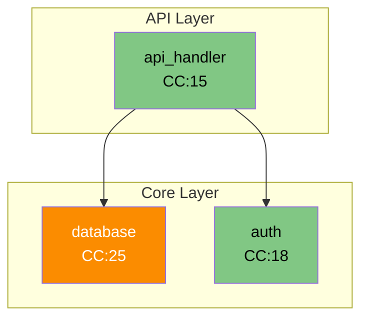

# Python Architecture Visualizer

A powerful CLI tool that analyzes Python repositories and generates visual architecture diagrams using Mermaid. Perfect for understanding complex Python codebases, technical documentation, and architecture reviews.

## Features

- Generate Mermaid diagrams showing component relationships and dependencies
- Analyze code complexity and maintainability metrics
- Security vulnerability scanning
- Test coverage analysis
- Docker layer analysis (when Dockerfile is present)
- Support for local directories and remote Git repositories

## Installation

```bash
# Clone the repository
git clone https://github.com/bobtheitguy31337/python-architecture-visualizer
cd python-architecture-visualizer

# Create and activate virtual environment
python -m venv venv
source venv/bin/activate  # On Windows: venv\Scripts\activate

# Install dependencies
pip install -r requirements.txt
```

## Usage

The tool provides a simple CLI interface:

```bash
# Analyze local directory
python viz-cli.py analyze ./my-python-project

# Analyze remote Git repository
python viz-cli.py analyze https://github.com/user/repo

# Save output to file
python viz-cli.py analyze ./my-project -o architecture.mmd

# Generate JSON output instead of Mermaid
python viz-cli.py analyze ./my-project -f json -o analysis.json
```

## Output Examples

The tool generates Mermaid diagrams with:
- Component relationships and dependencies
- Cyclomatic complexity indicators (color-coded)
- Layer-based grouping (API, Core, Client)

Example output:


## Requirements

- Python 3.8+
- Git
- Docker (optional, for container analysis)

## License

MIT License - See LICENSE file for details